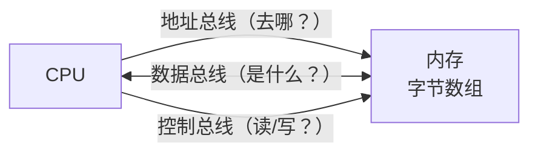

很多人学 C 语言的方式，像是在背字典：`int` 是整数，`*` 是指针，`malloc` 分配内存……背得很辛苦，但一写程序就出 bug，一出 bug 就蒙了。

问题出在哪？**缺少一张地图。**

C 语言是离机器最近的高级语言。理解 C，就是理解程序在机器里究竟发生了什么。这篇文章，就是要给你画这张地图。

---

## 一、计算机只懂一件事：读写内存

先抛掉所有复杂概念，把计算机简化到最核心的模型：



**内存，本质上是一个巨大的字节数组。**

4GB 内存意味着大约 40 亿个格子，每个格子存 1 个字节（8 位），每个格子都有唯一的编号——这个编号就叫**地址（address）**。

CPU 每次执行一条指令，无非就是：
- 从内存某个地址**读**一些字节
- 对这些字节做运算
- 把结果**写**回内存某个地址

你的 C 程序——无论多复杂——最终都会被翻译成这样的读写操作序列。

---

## 二、程序跑起来之前，操作系统做了什么

当你双击一个程序（或在命令行输入 `./a.out`），操作系统会：

1. 为这个程序创建一个**进程**（可以理解为：程序的运行实例）
2. 给这个进程分配一块**虚拟地址空间**
3. 把程序文件里的内容加载进去
4. 跳转到 `main` 函数开始执行

"虚拟地址空间"这个词听起来吓人，但概念很简单：**操作系统给每个进程一个假象，让它以为自己独占了全部内存**。每个进程看到的地址（比如 `0x7fff...`）都是虚拟地址，由操作系统负责映射到真实的物理内存。

这就是为什么两个程序可以同时运行，互不干扰。

---

## 三、进程内存的五个区域

操作系统给进程的这块虚拟地址空间，并不是一整块随便用。它被划分为**五个有明确用途的区域**：


逐一解释：

### 1. 代码段（Text Segment）

你写的 C 代码，经过编译器翻译，变成了一串**机器指令**（二进制）。这些指令存在代码段里。

```c
int add(int a, int b) {
    return a + b;
}
```

这个函数编译后，会变成若干条机器指令，住在代码段的某个地址开始的位置。

代码段是**只读的**。如果你试图修改它，操作系统会直接杀掉你的进程（Segmentation Fault）。

### 2. 数据段（Data Segment）

已经赋了初始值的**全局变量**和**静态变量**住在这里：

```c
int count = 100;          // 住在数据段
static double PI = 3.14;  // 住在数据段
```

程序启动时，操作系统从程序文件里读取这些初始值，写入数据段。

### 3. BSS 段

**未初始化**的全局变量和静态变量住在这里：

```c
int total;          // 住在 BSS 段，值为 0
static char buf[1024];  // 住在 BSS 段，全为 0
```

有个有意思的地方：BSS 段里的变量**全部自动初始化为 0**。

为什么？因为操作系统启动时会把 BSS 段清零，这是 C 标准保证的行为。（BSS 这个名字是历史遗留：Block Started by Symbol，不用记。）

### 4. 堆（Heap）

需要**手动管理**的动态内存：

```c
int *p = malloc(sizeof(int) * 100);  // 在堆上分配 400 字节
// ... 用完之后 ...
free(p);  // 必须手动释放
```

堆是用来存放**运行时才能确定大小**、或者**需要在函数之间共享**的数据的地方。

堆不会自动回收。`malloc` 之后不 `free`，这块内存就永远无法被程序再次使用，直到进程结束——这就是**内存泄漏**。

### 5. 栈（Stack）

函数的**局部变量**、**函数参数**、**返回地址**住在这里：

```c
void foo() {
    int x = 10;   // 住在栈上
    int y = 20;   // 住在栈上
    // 函数返回时，x 和 y 占用的栈空间自动释放
}
```

每次调用函数，操作系统会在栈上分配一块空间（叫**栈帧**），用于存放这次调用的局部变量和参数。函数返回时，这块空间自动归还。

栈的方向是**向低地址增长**的——越晚声明的变量，地址越小。

---

## 四、用代码亲眼看见这五个区域

理论说完了，我们来让程序自己"汇报"它的内存布局：

```c
#include <stdio.h>
#include <stdlib.h>

int global_init = 42;   // 数据段
int global_zero;        // BSS 段

int main() {
    int local = 10;              // 栈
    int *heap_p = malloc(4);     // 堆

    printf("代码段 (main函数地址): %p\n", (void*)main);
    printf("数据段 (global_init) : %p\n", (void*)&global_init);
    printf("BSS段  (global_zero) : %p\n", (void*)&global_zero);
    printf("堆     (heap_p指向)  : %p\n", (void*)heap_p);
    printf("栈     (local变量)   : %p\n", (void*)&local);

    free(heap_p);
    return 0;
}
```

编译运行（`gcc mem.c -o mem && ./mem`），你会看到类似这样的输出：

```
代码段 (main函数地址): 0x55a3b2c01149
数据段 (global_init) : 0x55a3b2c04010
BSS段  (global_zero) : 0x55a3b2c04014
堆     (heap_p指向)  : 0x55a3b2e8b2a0
栈     (local变量)   : 0x7fff4a3c1b1c
```

注意地址的大小顺序（低→高）：

```
代码段 ≈ 0x55...01...   最小
数据段 ≈ 0x55...04...   稍大
BSS段  ≈ 0x55...04...   紧邻数据段
堆     ≈ 0x55...8b...   更大
栈     ≈ 0x7fff...      最大（接近地址空间顶端）
```

这正好和图示的"低地址到高地址"分布一致。

---

## 五、用这张地图解释三个常见困惑

### 困惑 1：为什么局部变量不能"带出"函数？

```c
int* danger() {
    int x = 42;
    return &x;  // ⚠️ 返回局部变量的地址！
}

int main() {
    int *p = danger();
    printf("%d\n", *p);  // 未定义行为！
}
```

`x` 住在栈上。`danger()` 返回后，它的栈帧被销毁，`x` 的地址对应的内存已经"归还"给系统，随时可能被其他函数覆盖。你拿着 `p` 去读，读到的是垃圾值，或者直接 Segfault。

**根本原因：栈帧随函数返回而消失。**

### 困惑 2：为什么全局变量默认是 0，局部变量却是"随机值"？

- 全局/静态变量 → 住在 BSS 段 → 操作系统启动时保证清零 → 默认 0
- 局部变量 → 住在栈上 → 上一次函数调用留下的任意字节 → "随机"垃圾值

这不是 C 语言"设计上的不一致"，而是内存区域特性决定的。

### 困惑 3：`malloc` 之后不 `free` 会怎样？

```c
void leak() {
    int *p = malloc(1024 * 1024);  // 申请 1MB 堆内存
    // 忘记 free(p);
}  // p 这个局部变量（栈上）消失了，但它指向的堆内存还在！
```

`p` 是个局部变量，存在栈上，函数返回后销毁。但 `p` 指向的那块堆内存，没有任何变量再持有它的地址，程序再也无法访问和释放它——泄漏了。

进程结束时，操作系统会回收全部内存。但对于长期运行的服务器程序，泄漏积累会耗尽内存导致崩溃。

---

## 六、小结：带走这张地图

```
你写的代码 → 代码段（只读，永远在那里）
你的全局变量 → 数据段 / BSS 段（程序生命周期内一直存在）
你的局部变量 → 栈（函数调用时创建，返回时销毁）
你的动态内存 → 堆（malloc 创建，free 销毁，你负责）
```

C 的所有"奇怪行为"，几乎都能从这张地图找到解释：
- 指针是什么？→ 存地址的变量（第 3 篇讲）
- 数组越界为什么会覆盖别的变量？→ 内存是连续的，C 不检查边界
- 递归太深为什么崩溃？→ 栈空间有限（通常 1–8MB），溢出了（第 2 篇讲）

---

## 动手练习

1. 运行上面的代码，观察五个地址的大小关系，与图示是否一致？
2. 在 `main` 里声明第二个局部变量 `int local2 = 20;`，打印 `&local` 和 `&local2`，哪个地址更小？为什么？
3. （进阶）在 Linux 上，在 `printf` 前加一句：
   ```c
   system("cat /proc/self/maps");
   ```
   找到输出里的 `[stack]` 和 `[heap]` 行，与你打印出的地址对应上。
